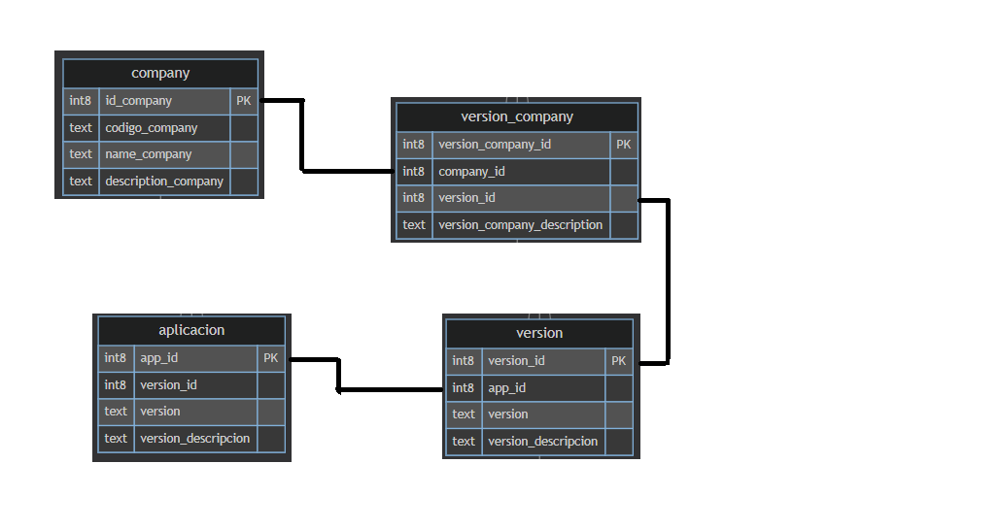

# Aplicación CRUD de Compañías

Este proyecto implementa un sistema completo Full Stack que permite realizar operaciones CRUD (Crear, Leer, Actualizar y Eliminar) sobre entidades del tipo Compañía, incluyendo una interfaz moderna con React y un backend robusto con Spring Boot 
y conexión a base de datos SQL Server.

#📁 Estructura del Proyecto

```
css
Copiar
Editar
├── backend/
│   └── src/main/java/com/ejemplo/controller/CompanyController.java
│
└── frontend/
    ├── src/App.tsx
    ├── src/aplicaciones/UserList/UserList.tsx
    └── src/aplicaciones/UserList/CompanyCrud.tsx

```


🚀 Tecnologías Utilizadas
Backend
Java 17

Spring Boot 3.x

JDBC Template

SQL Server

Maven

Frontend
React 18

TypeScript

Vite

CSS

🔧 Configuración del Backend
📄 Requisitos
Java 17+

Maven

SQL Server (conectado en puerto 1433)

📦 Dependencias principales (pom.xml)
xml
Copiar
Editar
<dependencies>
  <dependency>
    <groupId>org.springframework.boot</groupId>
    <artifactId>spring-boot-starter-web</artifactId>
  </dependency>
  <dependency>
    <groupId>org.springframework.boot</groupId>
    <artifactId>spring-boot-starter-jdbc</artifactId>
  </dependency>
  <dependency>
    <groupId>com.microsoft.sqlserver</groupId>
    <artifactId>mssql-jdbc</artifactId>
    <version>12.4.2.jre17</version>
  </dependency>
</dependencies>
⚙️ Configuración de conexión (application.properties)
properties
Copiar
Editar
spring.datasource.url=jdbc:sqlserver://31.97.133.226:1433;databaseName=miBaseDatos
spring.datasource.username=SA
spring.datasource.password=PruebDeTalento!
spring.datasource.driver-class-name=com.microsoft.sqlserver.jdbc.SQLServerDriver
server.port=8080

▶️ Ejecución

```
cd backend
mvn spring-boot:run
```

El servidor quedará activo en http://localhost:8080.

💻 Configuración del Frontend
📄 Requisitos
Node.js 18+

Vite

npm o yarn

▶️ Ejecución


```
cd frontend
npm install
npm run dev
```

El frontend estará disponible en http://localhost:5173.

✅ Funcionalidades
Backend (CompanyController.java)
GET /company: Listar todas las compañías

GET /company/{codigo}: Obtener compañía por código

POST /company: Crear nueva compañía

PUT /company/{codigo}: Actualizar compañía

DELETE /company/{codigo}: Eliminar compañía

DELETE /company/duplicates: ❗ Eliminar compañías duplicadas automáticamente por codigo_company

🔒 El endpoint de eliminación de duplicados elimina todos los registros que comparten el mismo codigo_company, excepto uno.

Frontend (App.tsx, UserList, CompanyCrud)
Visualización de compañías con sus versiones

CRUD de compañías

Botón para eliminar compañías duplicadas

Mini calculadora con validación (incluye raíz cuadrada)

Generador de palabras aleatorias (con caracteres restringidos)

📌 Notas Adicionales
El backend está habilitado con @CrossOrigin(origins = "http://localhost:5173") para permitir desarrollo local.

El sistema incluye validaciones en frontend y backend para manejo de errores y estados.

📋 Reporte y Argumentación
La lógica de eliminación de duplicados usa ROW_NUMBER() en una CTE para identificar y borrar todas las filas duplicadas de la tabla company basándose en codigo_company.

El botón “Eliminar empresas duplicadas” en la UI ejecuta el DELETE /company/duplicates, lo que garantiza un listado único de registros.

La integración React + Spring Boot permite una experiencia fluida y mantiene separación clara entre lógica de presentación y lógica de negocio.

# Tablas y relaciones
## Company

```
id_company (PK): Identificador único de la empresa.

codigo_company (UNIQUE): Código único para cada empresa.

Application

app_id (PK): Identificador único de la aplicación.

codigo_app (UNIQUE): Código único para cada aplicación.
```

Version

```
version_id (PK): Identificador único de la versión.

app_id (FK, UNIQUE): Referencia a la aplicación (una aplicación solo puede tener una versión).

version: Nombre de la versión.

version_descripcion: Descripción de la versión.
```

Version_Company

```
version_company_id (PK): Identificador único de la relación.

company_id (FK, UNIQUE): Referencia a la empresa (una empresa solo puede tener una versión asociada).

version_id (FK): Referencia a la versión.

version_company_description: Descripción de la asociación.
```


Relaciones clave
Cada empresa (Company) puede tener una sola versión de una aplicación (Version_Company con company_id único).

Cada aplicación (Application) tiene una sola versión (Version) asociada (app_id único en Version).

La tabla Version_Company conecta Company con Version, estableciendo qué versión de qué aplicación tiene cada empresa.

Diagrama visual



```
sqlcmd -S 31.97.133.226,1433 -U SA -P 'PruebDeTalento!' -d miBaseDatos -Q "CREATE TABLE company (
    id_company BIGINT IDENTITY(1,1) PRIMARY KEY,
    codigo_company NVARCHAR(100) UNIQUE NOT NULL,
    name_company NVARCHAR(255) NOT NULL,
    description_company NVARCHAR(MAX)
);" -C -N


sqlcmd -S 31.97.133.226,1433 -U SA -P 'PruebDeTalento!' -d miBaseDatos -Q "CREATE TABLE application (
    app_id BIGINT IDENTITY(1,1) PRIMARY KEY,
    codigo_app NVARCHAR(100) UNIQUE NOT NULL,
    name_app NVARCHAR(255) NOT NULL,
    description_app NVARCHAR(MAX)
);" -C -N


sqlcmd -S 31.97.133.226,1433 -U SA -P 'PruebDeTalento!' -d miBaseDatos -Q "CREATE TABLE version (
    version_id BIGINT IDENTITY(1,1) PRIMARY KEY,
    app_id BIGINT NOT NULL UNIQUE,
    version NVARCHAR(100) NOT NULL,
    version_descripcion NVARCHAR(MAX),
    FOREIGN KEY (app_id) REFERENCES application(app_id)
);" -C -N

sqlcmd -S 31.97.133.226,1433 -U SA -P 'PruebDeTalento!' -d miBaseDatos -Q "CREATE TABLE version_company (
    version_company_id BIGINT IDENTITY(1,1) PRIMARY KEY,
    company_id BIGINT NOT NULL UNIQUE,
    version_id BIGINT NOT NULL,
    version_company_description NVARCHAR(MAX),
    FOREIGN KEY (company_id) REFERENCES company(id_company),
    FOREIGN KEY (version_id) REFERENCES version(version_id)
);" -C -N
```
